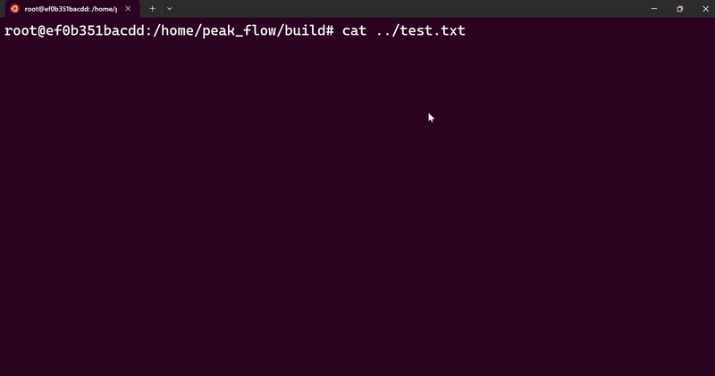

# Peak Flow
Find the shortest continuous subsequences with the summation which is equal or greater than specific number. In peak.cpp, we implement a **sliding window method** to update the left index and right index of the subarray. We know that sliding window method can reach O(n).

## Docker
```shell
# download docker image
# ref: https://hub.docker.com/r/jfalcou/compilers/tags
# OS/ARCH/LANG: linux/amd64/gcc-11, gcc-12 (support C++20)
docker pull jfalcou/compilers:v6

# run it
cd ${workspace}/peak_flow
docker run -v ./:/home/peak_flow --rm -it jfalcou/compilers:v6
```

## Run it
```shell
cd peak_flow
mkdir build && cd build
cmake .. && make -j7
./peak ${Given Number} ${Location of test.txt}
# ex: ./peak 80 ../test.txt
```

## Result
